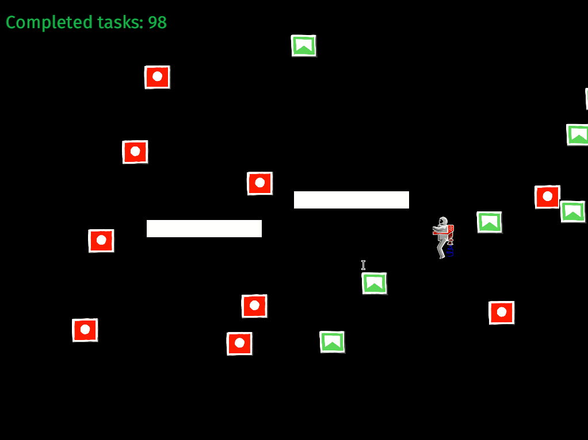
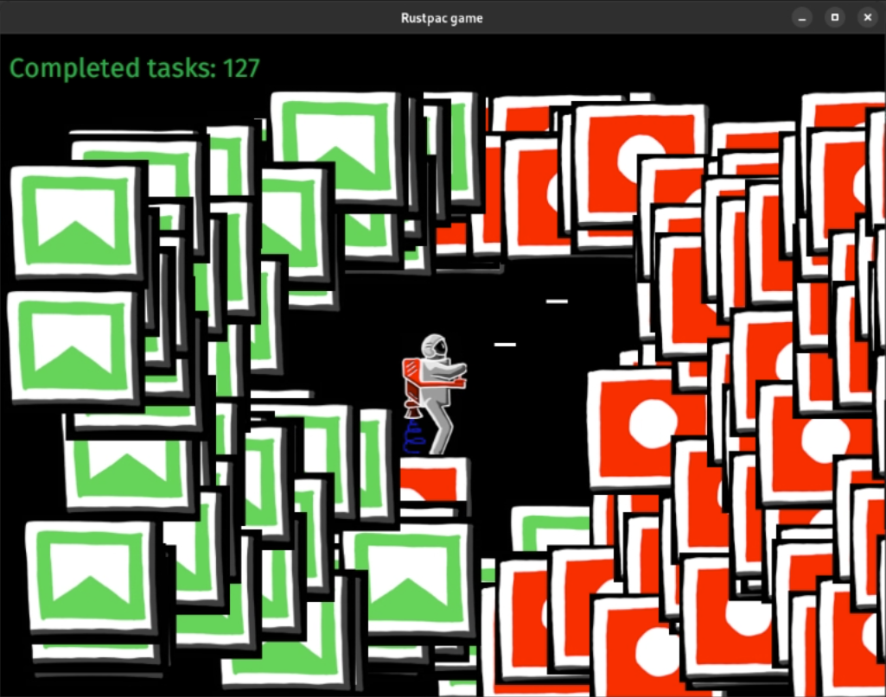

# Rustpac

2D game freely inspired by ZX Spectrum game Jetpac.



12.02.2023 - Map, gamebalace, smaller models

29.09.2022 version - Player, enemies, collision, score counting, end-screen



## How To Build It ?

Download Rust compiler from [here](https://www.rust-lang.org/en-US/), change the working directory to the root of this project, then execute the following command:

```
> cargo run --release
```

The executable binary will appear in `target/debug`, called `rustpac`.

## Controls

- move arrow keys/ASWD
- shoot L/R CTRL 


## Bugs

- Yes.
